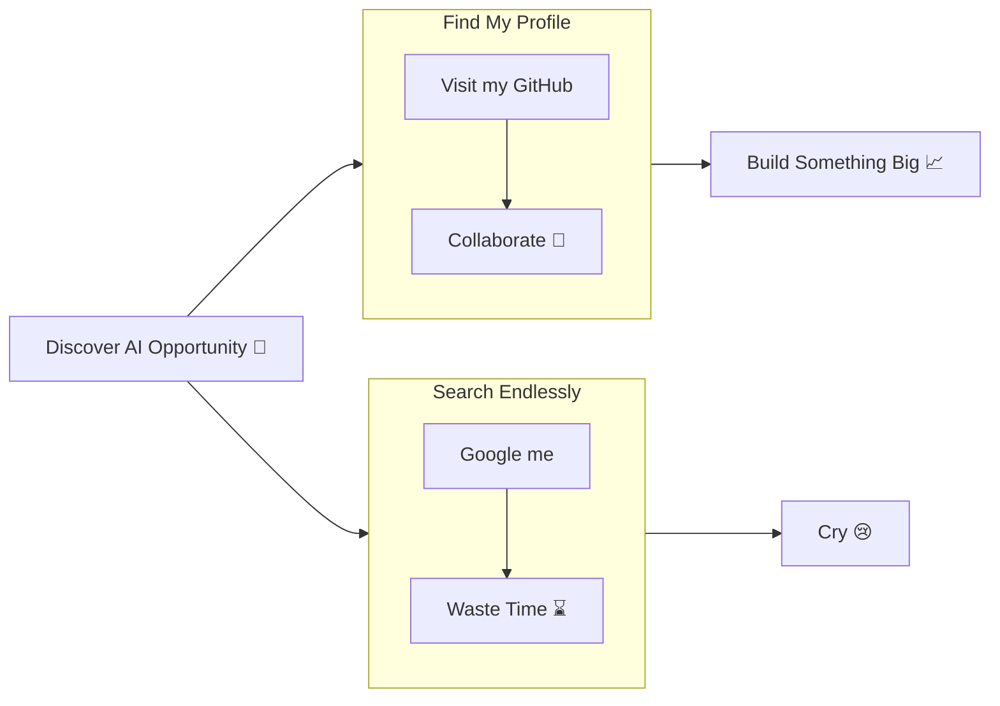

# 👋🏻 Hello — I’m Gian Paolo (GP)

I’m a hands-on ML Engineer focused on **production Generative AI**: agentic systems, enterprise RAG, multimodal pipelines (vision/speech/OCR), and **multi-GPU / multi-node** inference on Kubernetes/Docker.

Since years, I’ve been building AI systems that go from prototype → hardened services → monitored deployments — with a strong bias for clean architecture, reproducibility, and real-world impact.

## 🚀 What I do
- **Agentic AI + RAG platforms**: secure retrieval, tool use, multi-step workflows, evaluation + tracing
- **Generative & multimodal pipelines**: vision, speech, OCR, diffusion, embeddings + reranking
- **GPU infrastructure & inference**: vLLM / Hugging Face TGI, Kubernetes/Docker (bare metal + cloud)
- **Engineering discipline**: refactor research code into modular libraries, APIs, tests, configs (Hydra-style), observability

## 📫 Let’s Connect

* **Email:** [gianpaolo.santopaolo@gmail.com](mailto:gianpaolo.santopaolo@gmail.com)
* **LinkedIn:** [https://www.linkedin.com/in/gianpaolosantopaolo/](https://www.linkedin.com/in/gianpaolosantopaolo/)
* **Blog:** [https://genmind.ch/](https://genmind.ch/)

   

<!--

```mermaid
flowchart LR
    subgraph A[Find My Profile]
      P[Visit my GitHub] --> H[Collaborate 🤝]
    end
    subgraph B[Search Endlessly]
      S[Google me] --> W[Waste Time ⌛]
    end
    D[Discover AI Opportunity 🐛] --> A
    D --> B
    A --> O[Build Something Big 📈]
    B --> C[Cry 😢]
```
-->
