## 👋🏻 Hello!

This is Gian (GP for anyone outside Italy). I'm an accomplished technology leader with 20 years of experience in software engineering and enterprise architecture, with a laser-focused focus on AI innovation since 2017. I blend hands-on coding with strategic design to deliver agentic, generative AI solutions, ranging from fine-tuning large language models to architecting multimodal Retrieval-Augmented Generation systems and orchestrating multi-GPU/multi-node distributed AI clusters. Currently enrolled in Stanford’s Professional AI Program (XCS224N: NLP with Deep Learning; XCS236: Deep Generative Models; XCS231N: Deep Learning for Computer Vision), I drive scalable, compliant AI development and deployments across cloud and on-prem environments. As a former Microsoft MVP (2012–2022) and Regional Director (2018–2020), I partner with R&D, product owners, and customers to turn cutting-edge research and ideas into real-world impact.

<!--
## 👋🏻 Hello!

I’m Gian Paolo Santopaolo, an accomplished technology leader and hands-on coder with over 18 years of experience in software development, enterprise architecture, and AI innovation. As CTO at IBV Solutions and a former Microsoft MVP and Regional Director, I bridge R\&D, product, and customer engagement to deliver ethical, scalable AI and cloud solutions.

## 🚀 Most Recent Projects

|                            Project                           | Description                                                                                                                                                     |
| :----------------------------------------------------------: | :-------------------------------------------------------------------------------------------------------------------------------------------------------------- |
|       **[CogniX](https://github.com/gen-mind/cognix)**       | Open-source Retrieval-Augmented Generation (RAG) platform, enabling multimodal AI and enterprise data fine-tuning.                                              |
| **[Collaboard AI Integration](https://www.collaboard.app/)** | Enhanced Collaboard with generative AI features: background removal, sticky-note detection, AI search, knowledge graph, summarization, text & image generation. |
|                     **AI Code Generator**                    | Tool to analyze codebases and auto-generate repetitive code blocks, boosting developer productivity.                                                            |
|                 **Multimodal Vector Search**                 | Scalable vector-search system supporting 100M+ users with optimized embeddings via Qdrant and Milvus.                                                           |
|                     **AI Agents & Bots**                     | Custom AI agents: WhatsApp appointment bot, trading bot, real-estate assistant.                                                                                 |

## 🌟 Fun & Early Innovation

* Real-time collaboration tools (precursor concepts behind Miro & Mural).
* Biometric banking kiosk on Samsung Sur40 (best innovative solution, ABI Lab 2012).
* Stable Diffusion & Style-Transfer experiments.
* YOLO-based custom object-detection pipelines.

## 💻 Core Competencies

* **AI & Machine Learning:** LLM fine-tuning (Pixtral, Flux), distributed inference (multi‑GPU, vLLM, TGI), RAG systems, Transformers, Whisper, YOLO, Tesseract.
* **Cloud & DevOps:** Kubernetes & Docker (NVIDIA Container Toolkit), Azure (App Service, Functions, Cosmos DB), AWS & GCP, CI/CD pipelines.
* **Software Architecture:** Microservices, event-driven design, .NET, C#, Python, Go, Infrastructure-as-Code, high-availability & scalability.
* **Data Engineering:** Pipelines & storage, Apache Spark, Databricks, vector & time-series DBs.
* **Leadership & Ethics:** Team building, strategic AI roadmaps, GDPR & responsible AI advocacy.

## 🏢 Professional Experience

### IBV Solutions — CTO (Dec 2019–Present)

* Architected & built CogniX RAG platform and AI-driven Collaboard enhancements.
* Migrated monolith to microservices on Azure with Kubernetes/Docker.
* Led cross-functional teams (front-end, back-end, DevOps, SQA) and mentored engineers.
* Drove AI project delivery, stakeholder alignment, ethical & compliant deployment.

### Senior Architect & Team Leader (2001–2019)

* Led enterprise software initiatives in banking, finance, and tech sectors.
* Delivered cloud-native, service-oriented solutions, integrating early AI & real-time collaboration features.

## 🎓 Education & Certifications

* **Liceo Scientifico “E. Fermi”** (1994)
* **Stanford AI Professional Program** (approved, starting May 2025)
* **Machine Learning Specialization** (DeepLearning.AI & Stanford)
* **Mathematics for ML** (Imperial College London)
* Ongoing self-education in AI, ML, and software development.

## 🎤 Selected Speaking Engagements

* **API World, San Jose (2023):** From Monolith to Microservices with Kubernetes.
* **Future Tech, Amsterdam (2019):** ML Framework for .NET; AI for Every Developer.
* **Update Conference, Prague (2019):** AI for Every Developer.
* **.NET Conf (2018):** AI for Every Developer (3,000+ online attendees).
* **DevSum, Stockholm (2018):** ML for Developers.
* **Insider Dev Tour (2018):** Keynotes in Zurich & Milan.
* **ESPC, Copenhagen (2018):** ML for Developers.

## 📫 Let’s Connect

* **Email:** [gianpaolo.santopaolo@gmail.com](mailto:gianpaolo.santopaolo@gmail.com)
* **Phone:** +41 79 450 50 07
* **LinkedIn:** [https://www.linkedin.com/in/gianpaolosantopaolo/](https://www.linkedin.com/in/gianpaolosantopaolo/)
* **Blog:** [https://genmind.ch/](https://genmind.ch/)
* **GitHub (CogniX):** [https://github.com/gen-mind/cognix](https://github.com/gen-mind/cognix)
* **GitHub (Personal):** [https://github.com/gsantopaolo](https://github.com/gsantopaolo)

```mermaid
flowchart LR
    subgraph A[Find My Profile]
      P[Visit my GitHub] --> H[Collaborate 🤝]
    end
    subgraph B[Search Endlessly]
      S[Google me] --> W[Waste Time ⌛]
    end
    D[Discover AI Opportunity 🐛] --> A
    D --> B
    A --> O[Build Something Big 📈]
    B --> C[Cry 😢]
```

-->
